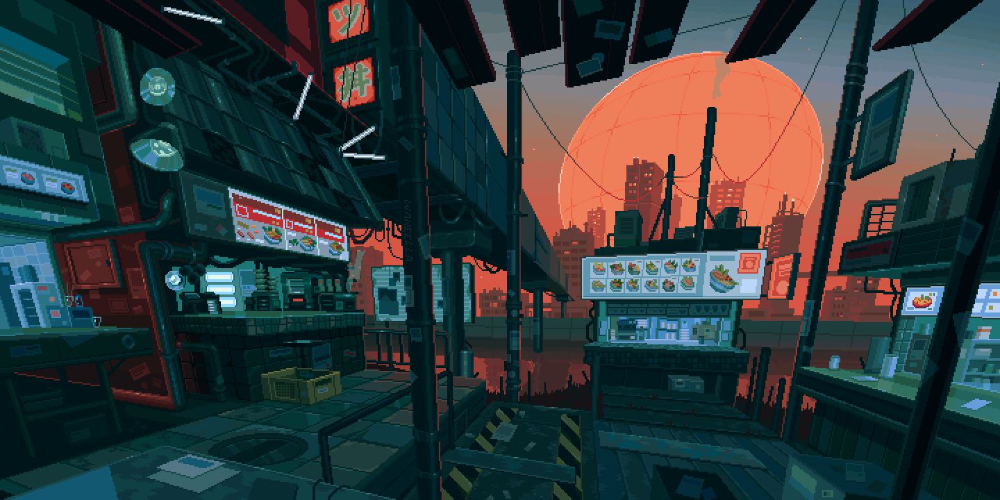
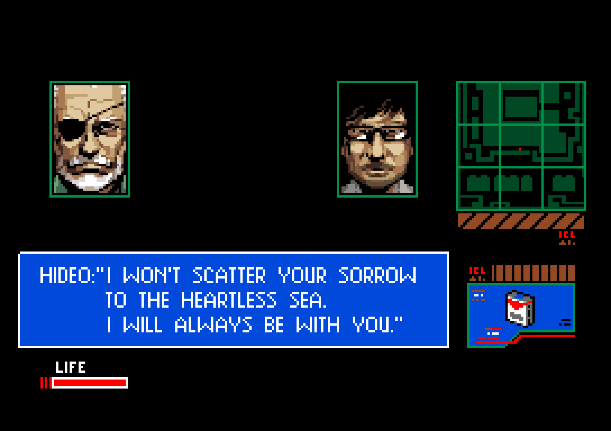

<!-- 动态效果 (英文) -->

  

<!-- 动态效果 (中文) -->
<!--暂定不用 -->

<!-- gif图 -->

  

---

<!-- 加入装饰性排版 -->

# About Me | 关于我  

👋 **I'm Weihou Zeng** (Call me Peter Parker, if you like!)  
🔭 Passionate about **full-stack development**, with a focus on backend technologies  
🌱 Exploring **Web3.0, AI, and blockchain**  
💬 Enjoy discussing tech, optimization, and cutting-edge innovations  

---

<!-- 插入更多样式 -->

  <h2 style="color: #6e7fdb; font-family: 'Segoe UI', Tahoma, Geneva, Verdana, sans-serif;">Full-Stack Developer | 全栈开发者</h2>
  
🎓 <strong>Graduate in Computer Science from UNSW</strong>

  
🎓 Starting a <strong>Master's in AI & Databases</strong> in 2025

  
💻 Experienced in <strong>Java</strong>, <strong>Python</strong>, and <strong>JavaScript</strong>

  
🌏 Based in <strong>Shenzhen</strong>, with academic roots in <strong>Sydney</strong>

  
📍 Interested in <strong>Web3.0, AI, and Blockchain Technologies</strong>

---

## 📈 GitHub 修仙统计卡片

---

## 🛠 Tech Stack | 技术栈
| **Category**   | **Tools & Frameworks**                                                                                |
|----------------|-------------------------------------------------------------------------------------------------------|
| **Backend**    |    |
| **Frontend**   |     |
| **Databases**  |    |
| **Other Tools**|    |

---

## ⚡ Cyberpunk Dashboard | 数据中枢

  
  

    

  <table>
    <tr>
      <td align="center" style="border: none;">
        
      </td>
      <td align="center" style="border: none;">
        
      </td>
    </tr>
  </table>

   
  

---

## 💬 Inspiring Quote of the Day | 每日一句

  <!-- 左侧：小岛秀夫的图片 -->
  

  <!-- 右侧：名人名言 -->
  

---

## 🔗 Connect with Me | 联系我的方式

  
  
  

<!-- 访客计数器 -->

  

---

  
Making progress every day. Built by WZ_Crypt.

---

<!-- 底部波浪效果 -->

