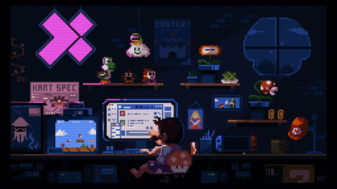

  
  # 👈😎 Welcome to WZ_Crypt's Profile! 😎👉

  

  **A Full-Stack Developer with a focus on Backend and Web3 Enthusiast.**

  🎓 Graduate from UNSW with a Bachelor of Computer Science.  
  🎓 Pursuing a Master's program in 2025, focusing on AI and Database Systems.  
  💻 Specializing in full-stack development with experience in Java, Python, and JavaScript.  
  🌏 Based in Shenzhen, China, but spent most of my academic journey in Sydney, Australia.  

  
  

  ---
  
  ## ⚡ About Me
  
  - 🔭 I’m currently working on Web3.0 projects.
  - 🌱 I’m exploring AI basics for backend integration.
  - 💬 Ask me about full-stack development and backend technologies.

---

## 🛠 Skills

| **Category**   | **Technologies**                                                                                       |
|----------------|-------------------------------------------------------------------------------------------------------|
| **Backend**    |    |
| **Frontend**   |    |
| **Databases**  |    |
| **Other Tools**|    |

---

## 🌱 Currently Learning

- 🔹 **Web3.0 Development**: Exploring blockchain technologies and dApps.
- 🔹 **AI Basics**: Building foundational knowledge for backend integration.
- 🔹 **Full-stack Optimization**: Focusing on scalable application architecture.

---

## 📊 GitHub Stats

  
  

---

## 🔗 Connect with Me

  
  
  

