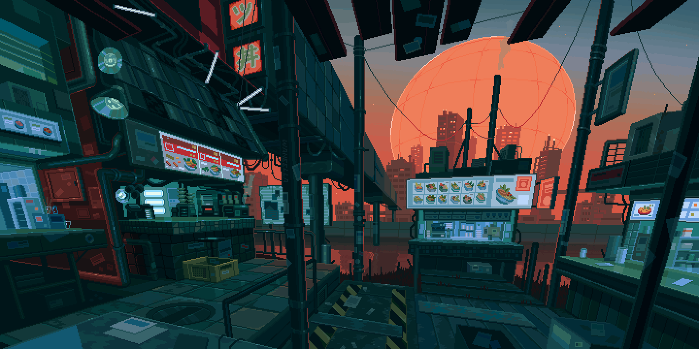

  

# WZ_CRYPT

### Systems · Software · Artificial Intelligence

**Peter Benjamin Parker · Weihou Zeng**

 

ARCHITECTURE → COMPUTER SCIENCE → AI RESEARCH → INFORMATION TECHNOLOGY

  

&nbsp;

&nbsp;

  

Designing systems across code, data, interaction and intelligence.

---

## 01 · PROFILE

I'm **Weihou Zeng**, also known as **Peter Benjamin Parker** and `WZ_Crypt`.

My academic path began with **architectural design**, moved into **computer science**, continued through **AI-related graduate research**, and now extends into **information technology and software systems**.

That path shaped the way I think about technology.

I see software not simply as code, but as an interaction between **structure, people, information, behaviour and computation**.

Today, my main interests lie in:

`Full-Stack Systems` · `Backend Engineering` · `Artificial Intelligence`

`Human–AI Interaction` · `Social Computing` · `System Design`

 

> **Design the structure. Understand the behaviour. Build the system.**

---

## 02 · ACADEMIC PATH

### 2019 — 2021 · University of Melbourne

**Bachelor of Design — Architecture**

My first academic background was architectural design.

It introduced me to thinking about **structure, space, users, constraints and experience** — ideas that still influence the way I approach software and system design today.

`Architecture` · `Design Thinking` · `Human Experience`

 

### Late 2021 — Sep 2024 · UNSW Sydney

**Computer Science**

I transitioned from designing physical environments to designing computational systems.

My study focused on programming, algorithms, software development and the foundations of computer science.

`Computer Science` · `Software Development` · `Programming`

 

### 2025 · University of Melbourne

**Graduate Research · Computing and Information Systems**

Research interests centred around:

**Human AI · Social Computing · Human–Computer Interaction**

with an interest in intelligent and sociotechnical systems, human behaviour, digital interaction and the relationship between people and AI.

`Human AI` · `Social Computing` · `HCI` · `Artificial Intelligence`

 

### 2026 · Monash University

**Master of Information Technology**

My current work brings together the technical and applied sides of computing through software engineering, full-stack development, databases, cloud systems and industry-oriented projects.

`Software Engineering` · `Full Stack` · `Cloud` · `Data`

 

### `DESIGN → COMPUTATION → INTELLIGENCE`

2019 — 2026

---

## 03 · WHAT I BUILD

### Full-Stack Systems

I enjoy connecting the entire application flow:

**Interface → Application Logic → API → Data → Infrastructure**

Rather than treating frontend and backend as isolated areas, I am interested in how the complete system behaves as one product.

 

### Backend & Integration

My strongest interest within full-stack development is the backend side:

- REST APIs
- application logic
- data processing
- service integration
- databases
- system architecture

 

### Intelligent Applications

I am interested in AI when it becomes part of a useful software system.

That includes applications involving:

- human–AI interaction
- AI-assisted workflows
- behavioural and social computing
- intelligent interfaces
- automation
- decision support

---

## 04 · SELECTED SYSTEMS

### 🛡️ Online Scam Identification & Remediation

**Human-centred scam identification and response system**

A software project exploring how technology can help users identify suspicious interactions, understand scam risks and receive practical remediation guidance.

**Focus**

`Online Safety` · `AI` · `Full Stack` · `Human-Centred Design`

<b>View project scope</b>

 

The project explores the interaction between technical scam identification and usable remediation support.

Areas of interest include:

- scam identification
- user-facing explanations
- risk communication
- remediation guidance
- system architecture
- frontend–backend integration
- structured scam information

 

### 🧭 CalmRoute

**Sensory-Aware Route Planning System**

A route planning application exploring how environmental and sensory information can contribute to a more comfortable walking experience.

**Stack**

`React` · `FastAPI` · `MySQL` · `REST API`

<b>View project scope</b>

 

Key areas included:

- system architecture
- prototype and wireframe design
- user flows
- frontend–backend integration
- pedestrian data
- environmental information
- route planning
- technical feasibility

 

### 💊 DoseMate

**Context-Aware Medication Assistant**

A mobile application combining medication management, reminders, data visualisation and context-aware behaviour.

**Stack**

`Java` · `Android`

<b>View project scope</b>

 

Key areas included:

- medication history
- charts and visualisation
- user profile
- family contact
- reminder scheduling
- background tasks
- context-awareness engine
- sensor simulation

 

### ☁️ Cloud Media Platform

**Serverless Media Management System**

A cloud-oriented platform supporting authentication, media upload, search, metadata operations and file-management workflows.

**Focus**

`Cloud Architecture` · `Serverless` · `APIs`

<b>View project scope</b>

 

Key areas included:

- authentication
- frontend integration
- upload workflows
- search
- file details
- metadata
- media library
- API integration

 

### ♻️ Sustainable Web Platform

**Reusable Item & Waste Reduction Application**

A responsive web application centred around reusable items, filtering, validation and user interaction.

**Stack**

`Vue` · `JavaScript` · `HTML` · `CSS`

<b>View project scope</b>

 

Key areas included:

- reactive state
- computed filtering
- responsive layout
- validation
- reusable components
- interface design

---

## 05 · TECHNOLOGY

### Languages

  

### Frontend

  

### Backend

  

### Data

  

### Tools & Infrastructure

  

JAVA · PYTHON · JAVASCRIPT · REACT · VUE · FASTAPI · SQL · DOCKER

---

## 06 · RESEARCH & INTERESTS

### Human AI

How people understand, interact with and collaborate with intelligent systems.

 

### Social Computing

How digital and sociotechnical systems influence communication, communities and social interaction.

 

### Human–Computer Interaction

How systems can become more understandable, useful and responsive to human needs.

 

### Artificial Intelligence

How intelligent capabilities can be integrated into practical software rather than existing only as isolated models.

 

### Systems Engineering

How multiple components, interfaces, data sources and services can be designed to operate coherently.

 

`AI` · `HUMAN–AI` · `SOCIAL COMPUTING` · `HCI` · `SYSTEMS`

---

## 07 · GITHUB CULTIVATION

  

### `BUILD → TEST → LEARN → ITERATE`

Continuous cultivation, one commit at a time.

---

## 08 · FROM ARCHITECTURE TO SOFTWARE

My background across architecture and computing gives me two different ways of thinking about systems.

**Architecture** taught me to think about:

`Structure` · `People` · `Space` · `Constraints`

**Computer Science** added:

`Logic` · `Algorithms` · `Abstraction` · `Computation`

**AI Research** introduced:

`Behaviour` · `Interaction` · `Intelligence` · `Social Systems`

**Information Technology** connects them through:

`Applications` · `Integration` · `Infrastructure` · `Real-World Systems`

 

### DESIGN × COMPUTATION × INTELLIGENCE

Different disciplines. The same interest in complex systems.

---

## 09 · HOW I WORK

### 01 — Understand

Start with the actual problem rather than the technology.

### 02 — Design

Translate the problem into understandable flows, interfaces and system components.

### 03 — Build

Turn those components into a functioning software system.

### 04 — Test

Challenge assumptions and identify what does not work.

### 05 — Iterate

Use evidence, feedback and experience to improve the next version.

---

## 10 · PHILOSOPHY

 

### “I'm not interested in technology itself.  
### I'm interested in what it can do.”

**— Hideo Kojima**

 

Technology becomes meaningful when it expands what people can

**create · understand · experience · accomplish**

 

---

## 11 · CONNECT

### WZ_CRYPT

**Systems · Software · Intelligence**

 

&nbsp;

  

   

**Peter Benjamin Parker · Weihou Zeng**

 

University of Melbourne · UNSW Sydney · Monash University

  

`ARCHITECTURE → CS → AI → IT`

  

Building systems at the intersection of design, computation and intelligence.

  

