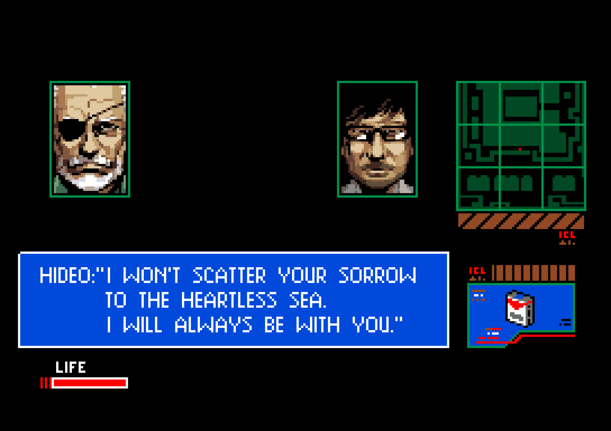

<div align="center">


<br/>


<br/><br/>

# 👋 Weihou Zeng

### Full-Stack Developer · Computer Science · Information Technology

**Peter** · `WZ_Crypt`

[](https://github.com/PeterZG)
[](mailto:weihouzeng@gmail.com)

</div>

---

## 🧑‍💻 About Me

```text
> Computer Science graduate from UNSW
> Master of Information Technology at Monash University
> Interested in full-stack development and backend systems
> Exploring AI, Web3 and emerging technologies
> Always learning, building and improving
```

I enjoy turning ideas into working software, with particular interest in **backend development, system integration and full-stack applications**.

My current focus is on building practical applications with modern web technologies while continuing to explore **AI, distributed systems and emerging technology**.

---

## 🛠 Tech Stack

### Languages


### Frontend


### Backend


### Databases


### Tools


---

## 🧬 GitHub Cultivation Record | 修仙记录

<div align="center">


</div>

---

## ⚡ System Dashboard

<div align="center">


<br/><br/>


<br/><br/>


</div>

---

## 🎮 Philosophy

<div align="center">



<br/><br/>

> **“I'm not interested in technology itself. I'm interested in what it can do.”**
> — Hideo Kojima

</div>

---

## 🌐 Connect

<div align="center">

[](https://github.com/PeterZG)
[](mailto:weihouzeng@gmail.com)

<br/>


</div>

---

<div align="center">

### `BUILD → TEST → LEARN → ITERATE`

**Making progress every day.**

<sub>Built by WZ_Crypt.</sub>

</div>

<br/>


